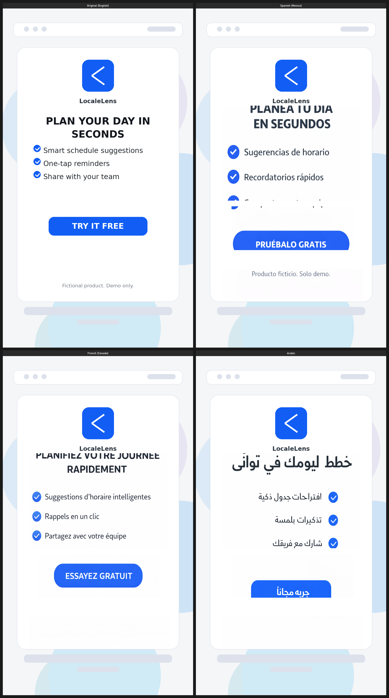
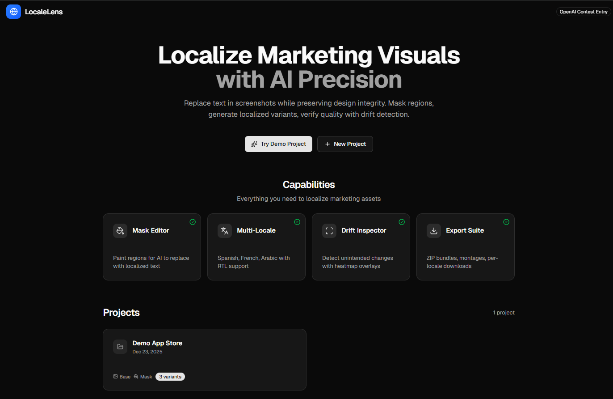
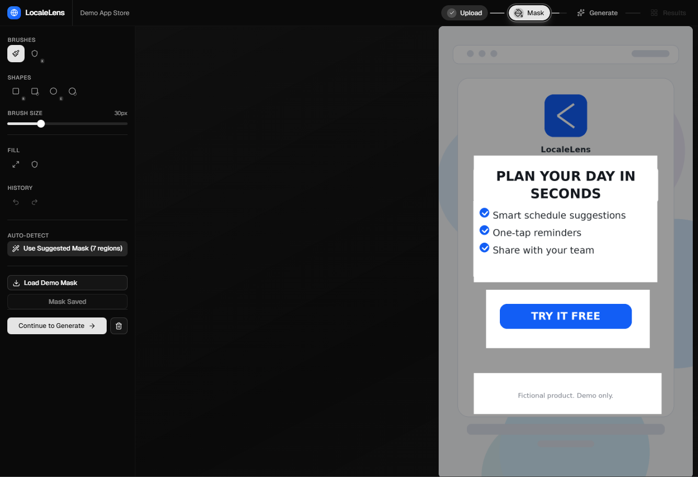
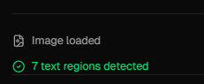
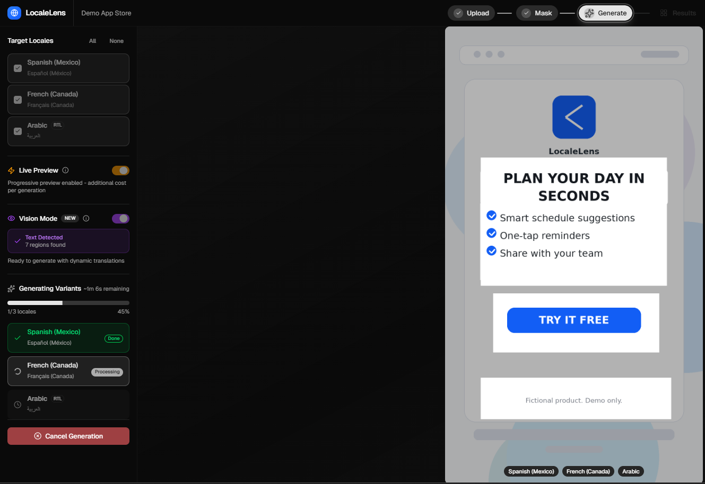
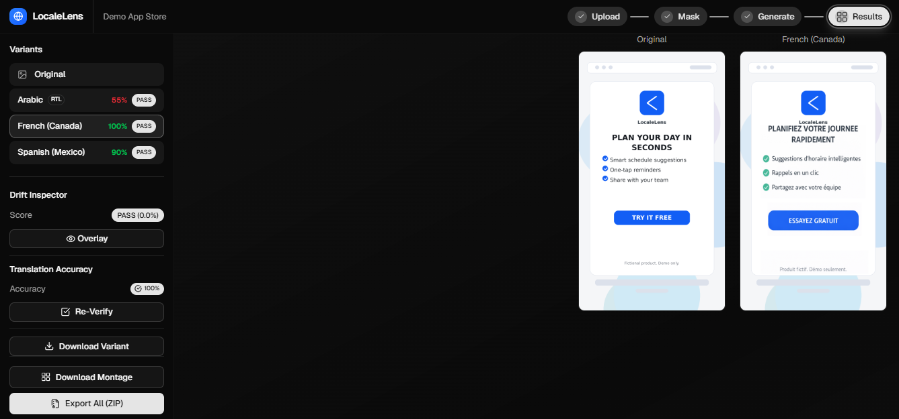

# LocaleLens

**AI-powered localization for marketing visuals. Upload any image. Get pixel-perfect translations.**


LocaleLens transforms marketing screenshots, posters, and banners into localized variants using a sophisticated three-model pipeline. It doesn't just translate text—it understands your image, preserves your design, and verifies the results.



Built for the [OpenAI Image Generation API Contest](https://openai.com/).

---

## The Problem

Localizing marketing visuals is painful:

- Manual Photoshop/Figma rework for each language
- Typography inconsistencies across locales
- No way to verify translations actually rendered correctly
- RTL languages (Arabic, Hebrew) require complete layout redesign

**LocaleLens solves this in under 60 seconds.**

---

## What Makes This Different

Most image generation demos are simple API wrappers. LocaleLens is a complete production pipeline:

| Capability | How It Works |
| --- | --- |
| **Universal Image Support** | Works with any image—not just pre-configured demos |
| **Three-Model Pipeline** | GPT-4o Vision analyzes → GPT-4o translates → gpt-image-1.5 generates |
| **AI-Written Prompts** | GPT-4o writes image-specific prompts for gpt-image-1.5 |
| **Pixel-Perfect Mode** | Guaranteed 0% drift outside masked regions |
| **Translation Verification** | GPT-4o Vision re-reads outputs to verify accuracy |
| **Streaming Preview** | Watch images generate in real-time |
| **RTL Support** | Full Arabic support with proper right-to-left rendering |

---

## Architecture: The Three-Model Pipeline

```text
┌─────────────────────────────────────────────────────────────────────────────┐
│                                                                             │
│    ┌──────────────┐      ┌──────────────┐      ┌──────────────┐            │
│    │   INSPECTOR  │      │  TRANSLATOR  │      │ PROMPT WRITER│            │
│    │ GPT-4o Vision│ ───▶ │    GPT-4o    │ ───▶ │    GPT-4o    │            │
│    │              │      │              │      │              │            │
│    │ • Detect text│      │ • Translate  │      │ • Write      │            │
│    │ • Find layout│      │ • Preserve   │      │   image-     │            │
│    │ • Extract    │      │   line count │      │   specific   │            │
│    │   style info │      │ • Handle RTL │      │   prompts    │            │
│    └──────────────┘      └──────────────┘      └──────────────┘            │
│                                                        │                    │
│                                                        ▼                    │
│    ┌──────────────┐      ┌──────────────┐      ┌──────────────┐            │
│    │   VERIFIER   │      │  COMPOSITOR  │      │    ARTIST    │            │
│    │ GPT-4o Vision│ ◀─── │    Sharp     │ ◀─── │gpt-image-1.5 │            │
│    │              │      │              │      │              │            │
│    │ • Re-read    │      │ • Pixel-     │      │ • Stream     │            │
│    │   output     │      │   perfect    │      │   generation │            │
│    │ • Compute    │      │   blend      │      │ • High       │            │
│    │   accuracy   │      │ • 0% drift   │      │   fidelity   │            │
│    └──────────────┘      └──────────────┘      └──────────────┘            │
│                                                                             │
└─────────────────────────────────────────────────────────────────────────────┘
```

**Why three models?**

gpt-image-1.5 is exceptional at generation but cannot "read" existing images. GPT-4o Vision provides the understanding that makes intelligent editing possible. By having GPT-4o write the prompts, we get image-specific instructions with exact spatial relationships—not generic templates.

---

## Workflow

### Step 1: Upload

Upload any marketing visual. LocaleLens automatically analyzes it with GPT-4o Vision, detecting text regions and understanding the layout.



### Step 2: Mask

Auto-detected text regions become suggested masks. Use the "Use Suggested Mask" button or refine manually with brush, rectangle, and ellipse tools.



The Vision pipeline identifies text regions automatically—in this example, 7 regions were detected including headlines, bullet points, and the CTA button.



### Step 3: Generate

Select target locales and generate. Enable **Live Preview** to watch images build up in real-time with streaming partial images.



**Streaming in action:**


### Step 4: Results

Compare variants side-by-side with the original. Every variant shows drift score verification—pixel-perfect mode consistently achieves **0% drift**.



Export options include individual PNGs, comparison montage, or a ZIP bundle with all assets.

---

## gpt-image-1.5 API Mastery

LocaleLens uses **every available parameter** for maximum quality:

```typescript
{
  model: "gpt-image-1.5",
  size: "auto",              // Optimal dimensions for input
  quality: "high",           // Maximum output quality
  background: "opaque",      // Prevent transparency artifacts
  output_format: "png",      // Lossless output
  moderation: "auto",        // Content-safe generation
  input_fidelity: "high",    // Preserve input details (faces, logos)
  stream: true,              // Real-time generation preview
  partial_images: 3          // Progressive reveal during streaming
}
```

| Parameter | Value | Purpose |
| --- | --- | --- |
| `size` | `"auto"` | Let API optimize for input dimensions |
| `quality` | `"high"` | Maximum detail preservation |
| `background` | `"opaque"` | Solid backgrounds, no transparency issues |
| `output_format` | `"png"` | Lossless format for production assets |
| `moderation` | `"auto"` | Standard content filtering |
| `input_fidelity` | `"high"` | Better preserve source image details |
| `stream` | `true` | Enable real-time preview |
| `partial_images` | `3` | Maximum progressive previews (0-3 supported) |

---

## Quick Start

```bash
git clone https://github.com/yourusername/localelens.git
cd localelens
pnpm install
pnpm db:push
pnpm dev
```

Open [http://localhost:3000](http://localhost:3000)

### Environment Setup

```bash
cp .env.example .env
```

```text
OPENAI_API_KEY=sk-...        # Required
DATABASE_URL=file:./db.sqlite
IMAGE_MODEL=gpt-image-1.5
```

### Demo Mode (No API Key Required)

LocaleLens includes pre-generated outputs for the full experience without API access:

```bash
pnpm demo:seed
pnpm dev
# Click "Try Demo Project" → "Demo Mode"
```

---

## Features

### Pixel-Perfect Composite Mode

Guarantees 0% drift outside the mask by compositing generated text regions onto the original image:

```text
Original pixels (mask = black) + Generated pixels (mask = white) = Perfect result
```

### Drift Inspector

Pixel-level diff analysis catches any unintended changes:

| Status | Threshold | Meaning |
| --- | --- | --- |
| **PASS** | ≤ 2% | Excellent preservation |
| **WARN** | 2-5% | Minor changes detected |
| **FAIL** | > 5% | Significant drift |

### Translation Verification

GPT-4o Vision re-reads generated images and compares to expected translations:

| Accuracy | Status |
| --- | --- |
| > 85% | Pass |
| 60-85% | Warning |
| < 60% | Fail |

### Supported Locales

| Locale | Language | Direction |
| --- | --- | --- |
| `es-MX` | Spanish (Mexico) | LTR |
| `fr-CA` | French (Canada) | LTR |
| `ar` | Arabic | RTL |

---

## Technical Implementation

### Project Structure

```text
src/
├── app/                          # Next.js App Router
│   ├── page.tsx                  # Homepage
│   ├── project/[id]/             # Workflow pages
│   └── api/variant/stream/       # SSE streaming endpoint
├── components/
│   ├── project/
│   │   ├── steps/                # Upload, Mask, Generate, Results
│   │   └── sidebar/              # Step-specific controls
│   └── ui/                       # shadcn/ui components
├── hooks/
│   ├── useProjectQueries.ts      # Data fetching
│   ├── useProjectMutations.ts    # Mutations
│   ├── useMaskEditor.ts          # Canvas state
│   ├── useStreamingGeneration.ts # SSE handling
│   └── useWorkflow.ts            # Step navigation
└── server/
    ├── api/routers/              # tRPC endpoints
    ├── domain/                   # Clean Architecture
    │   ├── entities/             # Type definitions
    │   ├── repositories/         # Interfaces (ISP)
    │   └── services/             # Business logic
    ├── infrastructure/           # Prisma implementations
    └── services/
        ├── openaiImage.ts             # gpt-image-1.5 client
        ├── textDetectionService.ts    # GPT-4o Vision analysis
        ├── translationService.ts      # GPT-4o translation
        ├── promptEngineeringService.ts # GPT-4o prompt writing
        ├── verificationService.ts     # Output verification
        └── maskSuggestionService.ts   # Auto-mask generation
```

### Key Services

| Service | Responsibility |
| --- | --- |
| `TextDetectionService` | GPT-4o Vision extracts text regions, layout, style |
| `TranslationService` | GPT-4o translates with length and line-count constraints |
| `PromptEngineeringService` | GPT-4o writes image-specific prompts for gpt-image-1.5 |
| `VerificationService` | GPT-4o Vision verifies rendered translations |
| `MaskSuggestionService` | Converts detected regions to mask rectangles |
| `OpenAIImageService` | Full gpt-image-1.5 integration with streaming |

### Database Schema

```prisma
model Project {
  id            String         @id
  name          String
  baseImagePath String?
  mask          Mask?
  variants      Variant[]
  analysis      ImageAnalysis?
}

model Variant {
  id                   String  @id
  locale               String
  prompt               String
  outputImagePath      String?
  driftScore           Float?
  driftStatus          String?
  translationAccuracy  Float?
  verificationStatus   String?
}
```

---

## Stack

| Layer | Technology |
| --- | --- |
| Framework | Next.js 15 (App Router) |
| Language | TypeScript (strict mode) |
| API | tRPC v11 |
| Database | Prisma + SQLite |
| Styling | Tailwind CSS v4 + shadcn/ui |
| Image Processing | Sharp |
| AI Models | GPT-4o Vision, GPT-4o, gpt-image-1.5 |

---

## Scripts

```bash
pnpm dev          # Development server
pnpm build        # Production build (Turbopack)
pnpm typecheck    # TypeScript validation
pnpm db:push      # Sync database schema
pnpm db:studio    # Open Prisma Studio
pnpm demo:seed    # Load demo assets
```

---

## Security

- **API keys are server-side only**—never exposed to the client
- **No credentials committed**—`.env` is gitignored
- **All data stored locally**—nothing leaves your machine
- **Content moderation enabled**—`moderation: "auto"` ensures appropriate outputs

---

## Documentation

| Document | Purpose |
| --- | --- |
| [Contest Spec](docs/CONTEST_SPEC.md) | Requirements and strategy |
| [Sprint Plan](docs/SPRINTS.md) | Development roadmap |
| [Engineering Decisions](docs/ENGINEERING_DECISIONS.md) | 59 documented decisions |
| [API Findings](docs/FINDINGS.md) | gpt-image-1.5 discoveries |

---

## Why LocaleLens

| Most Contest Entries | LocaleLens |
| --- | --- |
| Single API call wrapper | Three-model intelligent pipeline |
| Fixed demo images only | Universal image support |
| Generic prompt templates | AI-generated image-specific prompts |
| No quality verification | Drift detection + translation verification |
| Loading spinner | Real-time streaming preview |
| English output only | Full RTL Arabic support |

---

## Known Limitations & API Feedback

LocaleLens pushes gpt-image-1.5 to its limits. While the results are impressive, we encountered challenges that represent opportunities for future API improvements:

### Current Limitations

**Text Rendering Precision**
gpt-image-1.5 excels at creative generation but struggles with surgical text replacement. Even with detailed prompts specifying exact positions, fonts, and styling, the model may:

- Slightly reposition text relative to anchors (icons, buttons)
- Approximate rather than match original typography
- Occasionally alter font weights or letter spacing

Our pixel-perfect composite mode works around this by only using generated pixels within masked regions, guaranteeing 0% drift outside the mask. However, the text *within* the mask relies entirely on gpt-image-1.5's interpretation.

**Streaming Granularity**
The `partial_images` parameter (0-3) provides coarse feedback during generation. For a 30-second generation, receiving only 3 snapshots means ~10 second gaps between updates. Finer granularity would improve the streaming UX significantly.

**No Text Reading Capability**
gpt-image-1.5 cannot read or understand existing text in images, necessitating our three-model pipeline. A future model that combines GPT-4o Vision's understanding with gpt-image-1.5's generation could simplify this architecture considerably.

### Suggestions for OpenAI

Based on extensive testing, these improvements would unlock new use cases:

| Enhancement | Impact |
| --- | --- |
| **Text-aware editing mode** | Enable "replace text X with Y" without external Vision model |
| **Higher partial_images limit** | 10+ partials would enable smooth progress indication |
| **Font matching hints** | Accept font family/weight/size parameters for text regions |
| **Anchor-relative positioning** | "Place text 10px right of detected icon" semantics |
| **Mask-aware generation** | Guarantee unchanged pixels outside provided mask |

Despite these challenges, gpt-image-1.5 produces remarkably coherent results. The three-model pipeline demonstrates what's possible today while highlighting the potential for even tighter integration in future API versions.

---

## License

This project is licensed under **CC BY-NC 4.0** (Creative Commons Attribution-NonCommercial 4.0 International).

### You Are Free To

- **Share** — copy and redistribute the material in any medium or format
- **Adapt** — remix, transform, and build upon the material

### Under The Following Terms

- **Attribution** — You must give appropriate credit, provide a link to the license, and indicate if changes were made
- **NonCommercial** — You may not use the material for commercial purposes

### Additional Terms

- Commercial licensing available upon request
- Contest judges and OpenAI may use this submission freely for evaluation and promotional purposes

Full license text: [CC BY-NC 4.0](https://creativecommons.org/licenses/by-nc/4.0/)

---

**LocaleLens** — Intelligent image localization powered by GPT-4o Vision and gpt-image-1.5
